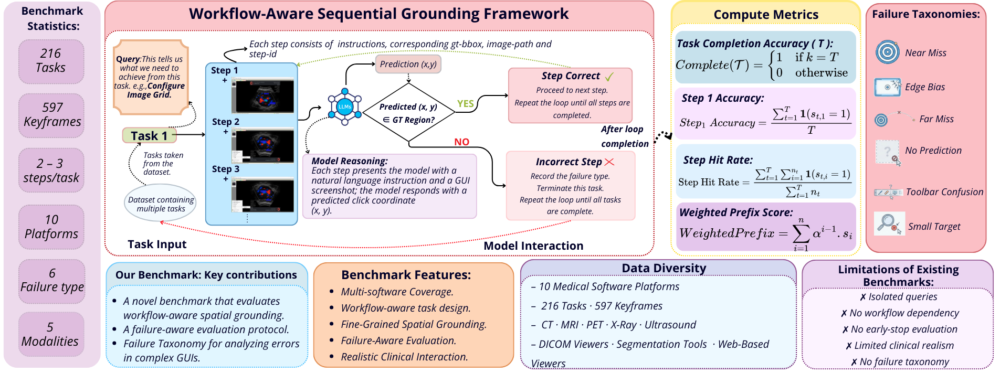
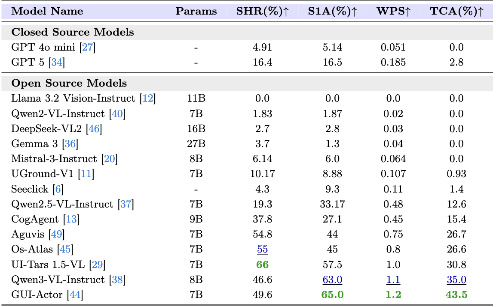

<div align="center">
  
</div>

<h1 align="left" style="margin:24px 0;">
    MedSPOT: A Workflow-Aware Sequential Grounding Benchmark for Clinical GUI
</h1>

  [](https://huggingface.co/datasets/Tajamul21/MedSPOT)


## Table of Contents
- [Overview](#overview)
- [Metrics](#metrics)
- [Installation](#installation)
- [Dataset Structure](#dataset-structure)
- [Evaluation](#evaluation)
- [Results](#results)
- [References](#references)

## Overview
<div align="center">
<figure class="center-figure"> </figure>
</div>

**MedSPOT** is a benchmark for evaluating Multimodal Large Language Models (MLLMs) on GUI grounding tasks in medical imaging software. It evaluates models on their ability to localize and interact with UI elements across 10 medical imaging applications including 3DSlicer, DICOMscope, Weasis, MITK, and others.

### Evaluation Protocol
Tasks are evaluated **sequentially** — if a model fails a step, the task is terminated early. This reflects real-world GUI interaction where errors compound.

---

### Metrics
| Metric | Description |
|--------|-------------|
|**TCA** (Task Completion Accuracy)|Fraction of tasks where ALL steps are completed correctly in sequence|
|**SHR** (Step Hit Rate)| Per-step accuracy across all evaluated steps  |
|**S1A** (Step 1 Accuracy)| Accuracy on the first step of each task |


---
## Installation

### Common Dependencies
```bash
pip install torch>=2.0 transformers>=4.40 pillow tqdm
```
Each model should be evaluated in its own recommended environment.  
Follow the official setup instructions for the specific model you are evaluating.


## Dataset Structure

```
MedSPOT-Bench/
  Annotations/
    3DSlicer_Annotation.json
    DICOMscope_Annotation.json
    Weasis_Annotation.json
    ...
  Images/
    3DSlicer/
    DICOMscope/
    Weasis/
    ...
```
📚 Check out our [dataset](https://huggingface.co/datasets/Tajamul21/MedSPOT) here!

### Annotation Format
Each annotation JSON follows this format:
```json
{
  "tasks": [
    {
      "task_overview": "Import new DICOM.",
      "steps": [
        {
          "step_id": 1,
          "image_path": "Images/MicroDicom/MD_(1).png",
          "instruction": "Click on the File menu in the top toolbar.",
          "actions": [
            {
              "type": "click",
              "target": "file_menu",
              "bbox": [
                0.22,
                0.39,
                2.79,
                2.51
              ]
            }
          ]
        },
        {
          "step_id": 2,
          "image_path": "Images/MicroDicom/MD_(2).png",
          "instruction": "Click on 'Open' to browse files.",
          "actions": [
            {
              "type": "click",
              "target": "open_option",
              "bbox": [
                1.12,
                11.03,
                18.1,
                2.9
              ]
            }
          ]
        },
        {
          "step_id": 3,
          "image_path": "Images/MicroDicom/MD_(3).png",
          "instruction": "Select the desired DICOM file from the file explorer.",
          "actions": [
            {
              "type": "click",
              "target": "select_file",
              "bbox": [
                12.4,
                18.23,
                4.02,
                2.33
              ]
            }
          ]
        },
      ]
    }
  ]
}
```

---

## Evaluation

🔬 Each script evaluates one model on the full benchmark. All scripts share the same interface:

| Script | Model |
|--------|-------|
| `evaluate_gui_actor.py` | GUI-Actor |
| `evaluate_gpt5.py` | GPT-5 |
| `evaluate_gpt4omini.py` | GPT-4o-mini |
| `evaluate_tars.py` | UI-TARS |
| `evaluate_cogagent.py` | CogAgent-9B |
| `evaluate_qwen2vl.py` | Qwen2-VL |
| `evaluate_qwen2_5vl.py` | Qwen2.5-VL |
| `evaluate_qwen3vl0.py` | Qwen3-VL |
| `evaluate_gemma3_27B.py` | Gemma3-27B |
| `evaluate_llama.py` | Llama-3.2-11B |
| `evaluate_osatlas.py` | OS-Atlas |
| `evaluate_seeclick.py` | SeeClick |
| `evaluate_uground.py` | UGround |
| `evaluate_Aguvis.py`  | Aguvis-7B |

---

### HuggingFace Models
🤗 Models are loaded directly from Hugging Face at runtime. Make sure you are logged in before running any evaluation
```bash
huggingface-cli login
``` 

For gated models, request access on the model's HuggingFace page beforehand 

### OpenAI Models (GPT-5, GPT-4o-mini)
Export your OpenAI API key before running evaluations:
```bash
export OPENAI_API_KEY=your_api_key

```

---

## Results

📊 Results are saved in the following structure:
```
results/
  ModelName/
    SoftwareName/
      task_results.json
      task_metrics.json
      failure_statistics.json
    overall_dataset_metrics.json
```
<div align="center">
  <figure align="left">  </figure>  
</div>

---

## References
📝 Please cite our paper if you use our benchmark or code in your work:
```bibtex
@article{medspot2026,
  title     = {MedSPOT: A Workflow-Aware Sequential Grounding Benchmark for Clinical GUI},
  author    = {anonymous},
  year      = {2026},
  note      = {Under review}
}
```
